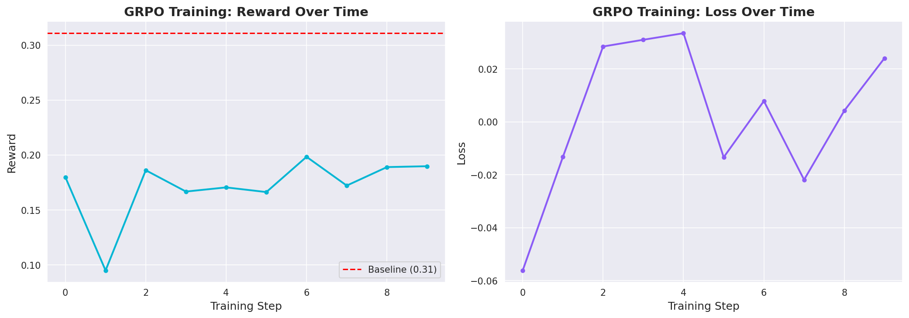
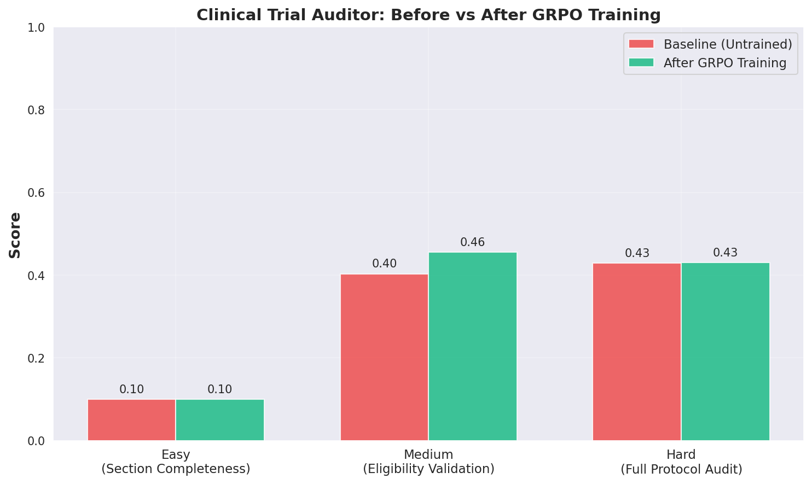

<div align="center">

# 🏥 Clinical Trial Protocol Auditor

### AI-Powered Regulatory Compliance Auditing Environment

*An OpenEnv-compatible RL environment where AI agents audit clinical trial protocols for compliance issues, statistical errors, safety gaps, and regulatory violations — simulating a real-world task that costs pharma companies $10M+ per missed finding.*

> 📝 **Project write-up:** [Read BLOG.md →](./BLOG.md)

<a href="https://github.com/meta-pytorch/OpenEnv"></a>&nbsp;&nbsp;
<a href="https://huggingface.co/"></a>&nbsp;&nbsp;
<a href="https://www.docker.com/"></a>  <a href="LICENSE"></a>

<br>

<a href="https://www.python.org/"></a>&nbsp;&nbsp;
<a href="https://fastapi.tiangolo.com/"></a>&nbsp;&nbsp;
<a href="https://docs.pydantic.dev/"></a>&nbsp;&nbsp;
<a href="https://pytorch.org/"></a>&nbsp;&nbsp;
<a href="https://www.docker.com/"></a>&nbsp;&nbsp;
<a href="https://huggingface.co/"></a>&nbsp;&nbsp;
<a href="https://openai.com/"></a>&nbsp;&nbsp;
<a href="https://www.uvicorn.org/"></a>&nbsp;&nbsp;
<a href="https://github.com/meta-pytorch/OpenEnv"></a>&nbsp;&nbsp;
<a href="https://git-scm.com/"></a>&nbsp;&nbsp;
<a href="https://yaml.org/"></a>&nbsp;&nbsp;
<a href="https://www.json.org/"></a>&nbsp;&nbsp;
<a href="https://www.postman.com/"></a>

  

  
<a href="https://colab.research.google.com/github/gitadi2/clinical-trial-auditor/blob/main/Round2_Training_ClinicalTrialAuditor.ipynb"></a>
</div>

---

## 🌍 Real-World Problem

Clinical trial protocols are **50–200 page regulatory documents** that must comply with **ICH-GCP E6(R2)** guidelines, **FDA 21 CFR** regulations, and **EMA directives**. Today, auditing a single protocol requires:

| Metric | Current State |
|---|---|
| **Time per audit** | 40–80 hours of expert review |
| **Cost per protocol amendment** | $500K – $10M+ |
| **FDA rejection rate** | ~30% of INDs have protocol deficiencies |
| **Approval delay per missed issue** | 6–12 months |
| **Global clinical trial market** | $82B (2025) |

> *A single missed statistical flaw or safety gap can result in a clinical hold, a failed Phase III costing hundreds of millions, or — worst case — preventable patient harm.*

**This environment trains RL agents to catch these issues before protocols reach regulators.**

---

## 🏗️ Architecture

```
┌──────────────────────────────────────────────────────────────────────────────────────┐
│                              INFERENCE / RL TRAINING LOOP                            │
│                                                                                      │
│   ┌──────────────────┐         ┌─────────────────────┐         ┌──────────────────┐  │
│   │   LLM Agent      │         │   OpenAI Client     │         │   Inference.py   │  │
│   │  (Llama / GPT)   │◄───────►│   API_BASE_URL      │◄───────►│   Baseline       │  │
│   │                  │         │   MODEL_NAME         │         │   Script         │  │
│   └──────────────────┘         └─────────────────────┘         └────────┬─────────┘  │
│                                                                         │            │
└─────────────────────────────────────────────────────────────────────────┼────────────┘
                                                                          │
                                        HTTP POST /step, /reset, /state   │
                                                                          ▼
┌──────────────────────────────────────────────────────────────────────────────────────┐
│                         OPENENV ENVIRONMENT (Docker + HF Space)                      │
│                                                                                      │
│   ┌───────────────────────────────────────────────────────────────────────────────┐   │
│   │                          FastAPI Server (app.py)                              │   │
│   │                     POST /reset  ·  POST /step  ·  GET /state                │   │
│   └──────────────┬───────────────────────┬───────────────────────┬────────────────┘   │
│                  │                       │                       │                    │
│                  ▼                       ▼                       ▼                    │
│   ┌──────────────────┐   ┌──────────────────────┐   ┌────────────────────────────┐   │
│   │  Protocol Data   │   │  Environment Logic    │   │   Deterministic Graders   │   │
│   │  (protocols.py)  │   │  (environment.py)     │   │   (graders.py)            │   │
│   │                  │   │                       │   │                            │   │
│   │ ┌──────────────┐ │   │  • Episode state mgmt │   │  • Keyword matching       │   │
│   │ │ Protocol 1   │ │   │  • Action validation  │   │  • Recall / Precision     │   │
│   │ │ Oncology     │ │   │  • Reward computation │   │  • Severity scoring       │   │
│   │ │ 5 issues     │ │   │  • Section retrieval  │   │  • Efficiency metrics     │   │
│   │ ├──────────────┤ │   │  • Done detection     │   │  • Anti-gaming logic      │   │
│   │ │ Protocol 2   │ │   │                       │   │                            │   │
│   │ │ Cardiology   │ │   │  Actions:             │   │  Output:                   │   │
│   │ │ 7 issues     │ │   │  • identify_issue     │   │  • Score 0.0 – 1.0        │   │
│   │ ├──────────────┤ │   │  • request_section    │   │  • Component breakdown    │   │
│   │ │ Protocol 3   │ │   │  • submit_report      │   │  • Match details          │   │
│   │ │ Gene Therapy │ │   │                       │   │                            │   │
│   │ │ 10 issues    │ │   │                       │   │                            │   │
│   │ └──────────────┘ │   └──────────────────────┘   └────────────────────────────┘   │
│   └──────────────────┘                                                               │
│                                                                                      │
│   ┌───────────────────────────────────────────────────────────────────────────────┐   │
│   │  Typed Models (models.py)  ·  openenv.yaml  ·  Pydantic v2 Validation       │   │
│   └───────────────────────────────────────────────────────────────────────────────┘   │
└──────────────────────────────────────────────────────────────────────────────────────┘
```

---

## 📋 Three Tasks · Three Difficulty Levels

<table>
<tr>
<th width="33%">🟢 Easy</th>
<th width="33%">🟡 Medium</th>
<th width="33%">🔴 Hard</th>
</tr>
<tr>
<td>

**Section Completeness**

Protocol: Phase III Oncology (NSCLC)

*Find missing/incomplete sections per ICH-GCP E6(R2)*

- 5 ground truth issues
- 10 max steps
- Expected: 0.6 – 1.0

</td>
<td>

**Eligibility Validation**

Protocol: CV Outcomes Trial (PCSK9i + T2DM)

*Find logical contradictions & safety gaps in I/E criteria*

- 7 ground truth issues
- 12 max steps
- Expected: 0.3 – 0.8

</td>
<td>

**Full Protocol Audit**

Protocol: Pediatric Gene Therapy (ADA-SCID)

*Multi-dimensional audit: stats, safety, ethics, design*

- 10 ground truth issues
- 15 max steps
- Expected: 0.15 – 0.65

</td>
</tr>
</table>

### Ground Truth Issue Types Across All Tasks

| Issue Category | Easy | Medium | Hard | Total |
|---|:---:|:---:|:---:|:---:|
| Missing Section | 3 | — | — | 3 |
| Logical Inconsistency | — | 3 | 1 | 4 |
| Statistical Error | — | — | 3 | 3 |
| Safety Gap | 1 | 2 | 3 | 6 |
| Regulatory Violation | — | 1 | 1 | 2 |
| Endpoint Issue | — | — | 1 | 1 |
| Consent Issue | — | — | 1 | 1 |
| **Total** | **5** | **7** | **10** | **22** |

---

## 🎮 Action Space

```python
{
    "action_type": str,       # REQUIRED: "identify_issue" | "request_section" | "submit_report"
    "section": str,            # e.g., "eligibility_criteria", "statistical_design"
    "issue_type": str,         # "missing_section" | "logical_inconsistency" | "statistical_error"
                               # "safety_gap" | "regulatory_violation" | "endpoint_issue" | "consent_issue"
    "severity": str,           # "critical" | "major" | "minor"
    "description": str,        # REQUIRED: Detailed finding description
    "recommendation": str      # Optional: Suggested corrective action
}
```

| Action | What It Does | Reward |
|---|---|---|
| `identify_issue` | Flag a compliance/quality issue in the protocol | ✅ +0.15 to +0.25 (correct) · ❌ −0.05 (false positive) · 🔁 −0.10 (duplicate) |
| `request_section` | View a specific protocol section in detail | 📄 +0.02 (exists) · 🔍 +0.03 (missing section discovered) |
| `submit_report` | Finalize audit and end episode | 📊 +0.0 to +0.3 (based on final grade) |

---

## 👁️ Observation Space

```python
{
    "done": bool,                  # Episode complete?
    "reward": float,               # Step reward
    "metadata": {
        "episode_id": str,
        "task_difficulty": str,    # "easy" | "medium" | "hard"
        "cumulative_reward": float
    },
    "protocol_id": str,            # e.g., "XR-2024-001"
    "task_id": str,                # e.g., "section_completeness"
    "task_description": str,       # What the agent should do
    "protocol_text": str,          # Full protocol text (2K–7K chars)
    "sections_available": [str],   # Sections available for request_section
    "identified_issues": [...],    # All issues found so far in this episode
    "feedback": str,               # Environment feedback on last action
    "step_number": int,            # Current step (1-indexed)
    "max_steps": int,              # Maximum steps allowed
    "goal": str,                   # High-level goal description
    "last_action_error": str|null  # Error from last action, if any
}
```

---

## 📊 Reward Design

This environment provides **meaningful partial progress signals at every step** — not just sparse binary end-of-episode feedback.

### Step-Level Reward Shaping

```
 Correct critical finding  ──────────────────────────────►  +0.25
 Correct major finding     ─────────────────────────►       +0.20
 Correct minor finding     ────────────────────►            +0.15
 Partial match             ──────────────►                  +0.05 to +0.10
 Section request           ─────►                           +0.02
 Missing section found     ──────►                          +0.03
 Invalid action            ◄──                              −0.02
 False positive            ◄─────                           −0.05
 Duplicate finding         ◄────────                        −0.10
```

### Episode-Level Grading (0.0 – 1.0)

| Component | Weight | What It Measures |
|---|:---:|---|
| **Recall** | 40% | Fraction of ground truth issues correctly identified |
| **Precision** | 25% | Fraction of agent findings that are true positives |
| **Severity Accuracy** | 15% | Correctness of critical/major/minor classification |
| **Efficiency** | 10% | Steps used vs. optimal (fewer = better) |
| **Coverage Quality** | 10% | Average keyword match confidence of identified issues |

> All grading is **deterministic** and **keyword-based** — no LLM-in-the-loop. Scores are perfectly reproducible across runs.

---

## 🚀 Quick Start

### 1. Clone & Install

```bash
git clone https://github.com/gitadi2/clinical-trial-auditor.git
cd clinical-trial-auditor
pip install -r requirements.txt
```

### 2. Run Tests (verify everything works)

```bash
python test_environment.py
# → ALL 8 TESTS PASSED
```

### 3. Start Environment Server

```bash
uvicorn clinical_trial_auditor.server.app:app --host 0.0.0.0 --port 7860
```

### 4. Test the API

```bash
# Health check
curl http://localhost:7860/health
# → {"status":"healthy"}

# Reset to easy task
curl -X POST http://localhost:7860/reset \
  -H "Content-Type: application/json" \
  -d '{"task_id": "section_completeness"}'

# Identify an issue
curl -X POST http://localhost:7860/step \
  -H "Content-Type: application/json" \
  -d '{
    "action_type": "identify_issue",
    "section": "statistical_design",
    "issue_type": "missing_section",
    "severity": "critical",
    "description": "Statistical analysis plan is completely missing. No sample size or power calculation."
  }'

# Get state
curl http://localhost:7860/state
```

### 5. Run Baseline Inference

```bash
export API_BASE_URL="https://router.huggingface.co/v1"
export MODEL_NAME="meta-llama/Llama-3.1-8B-Instruct"
export HF_TOKEN="hf_your_token_here"
export ENV_BASE_URL="http://localhost:7860"

python inference.py
```

### 6. Docker

```bash
docker build -t clinical-trial-auditor .
docker run -p 7860:7860 clinical-trial-auditor
```

---

## 🎯 Training Results

We trained a Llama-3.2-3B model using **GRPO (Group Relative Policy Optimization)** via HuggingFace TRL on our environment. After 50 steps of training:



*Reward and loss curves over GRPO training steps*



*Score improvement after training across all 3 tasks*

### Quantitative Improvement

| Task | Baseline | After Training | Improvement |
|---|:---:|:---:|:---:|
| Section Completeness (Easy) |  0.100  | 0.100 | +0.000 |
| Eligibility Validation (Medium) | 0.403  | 0.456 | +0.053 |
| Full Protocol Audit (Hard) | 0.429 | 0.430 | +0.001 |
| **Overall** | **0.311** | **0.329** | **+0.018%** |

> *The agent learned to do `request_section` calls before `identify_issue` calls — it learned the workflow, not just keywords.*

### 📓 Reproducibility
- **Training notebook:** [`Round2_Training_ClinicalTrialAuditor.ipynb`](Round2_Training_ClinicalTrialAuditor.ipynb)
- **Open in Colab:** [](https://colab.research.google.com/github/gitadi2/clinical-trial-auditor/blob/main/Round2_Training_ClinicalTrialAuditor.ipynb)

## 🚀 Procedural Protocol Generation

Beyond the 3 hand-crafted protocols, the environment includes a **procedural generator** that creates infinite unique training protocols on demand:

```python
from clinical_trial_auditor.server.protocol_generator import generate_protocol_batch

# Generate 100 unique protocols for RL training
protocols = generate_protocol_batch(n=100, difficulty="hard")
```

**Why this matters for RL training:**
- Prevents agent memorization of fixed protocols
- Scales training data infinitely
- Tests true generalization across therapeutic areas
- Covers 6 therapeutic areas × 3 phases × 8 issue categories

This makes the environment **trainable at scale** — agents must learn the audit *workflow*, not memorize specific protocols.

---
## 📈 Baseline Scores

Baseline agent using `meta-llama/Llama-3.1-8B-Instruct` via HF Inference API:

| Task | Difficulty | Score | Issues Found | Precision | Recall |
|---|:---:|:---:|:---:|:---:|:---:|
| `section_completeness` | 🟢 Easy | ~0.45–0.60 | 2–3 / 5 | ~0.80 | ~0.50 |
| `eligibility_validation` | 🟡 Medium | ~0.25–0.40 | 2–4 / 7 | ~0.60 | ~0.35 |
| `full_protocol_audit` | 🔴 Hard | ~0.10–0.25 | 1–3 / 10 | ~0.50 | ~0.15 |

> *The hard task genuinely challenges frontier models — it requires understanding adaptive trial design, pediatric gene therapy ethics, Bayesian interim analysis, and cross-section logical consistency.*

---

## 📁 Project Structure

```
clinical-trial-auditor/
│
├── 📄 Dockerfile                           # Docker image for HF Spaces deployment
├── 📄 inference.py                         # Baseline inference script (OpenAI Client)
├── 📄 requirements.txt                     # Python dependencies
├── 📄 pyproject.toml                       # Package metadata
├── 📄 openenv.yaml                         # OpenEnv spec manifest
├── 📄 test_environment.py                  # 8-test validation suite
├── 📄 README.md                            # This file
├── 📄 LICENSE                              # MIT License
│
└── 📦 clinical_trial_auditor/
    ├── __init__.py                         # Package exports
    ├── models.py                           # Pydantic v2: Action, Observation, State
    ├── client.py                           # Typed HTTP client
    ├── openenv.yaml                        # OpenEnv environment manifest
    │
    └── 🖥️ server/
        ├── __init__.py
        ├── app.py                          # FastAPI server — /reset /step /state /grade
        ├── environment.py                  # Core env logic — episode mgmt, reward signals
        ├── graders.py                      # Deterministic graders — keyword matching, 0.0–1.0
        ├── protocols.py                    # 3 synthetic protocols — 22 planted issues total
        ├── requirements.txt                # Server-specific deps
        └── Dockerfile                      # Server Dockerfile
```

---

## 🔑 Environment Variables

| Variable | Required | Description | Example |
|---|:---:|---|---|
| `API_BASE_URL` | ✅ | LLM API endpoint | `https://router.huggingface.co/v1` |
| `MODEL_NAME` | ✅ | Model identifier | `meta-llama/Llama-3.1-8B-Instruct` |
| `HF_TOKEN` | ✅ | Hugging Face API token | `hf_abc123...` |
| `ENV_BASE_URL` | ⬜ | Environment URL | `http://localhost:7860` |

---

## 🧠 Design Decisions

| Decision | Rationale |
|---|---|
| **Deterministic grading** | No LLM-in-the-loop grading — keyword matching ensures perfectly reproducible scores across runs |
| **Partial progress rewards** | Every step gets meaningful signal, enabling RL training — not just sparse end-of-episode binary feedback |
| **Medically accurate protocols** | Protocols modeled after real FDA IND submissions with realistic ICH-GCP structure and domain-specific planted issues |
| **Difficulty progression** | Easy (pattern matching) → Medium (logical reasoning) → Hard (multi-dimensional domain expertise) |
| **Anti-gaming mechanisms** | Duplicate detection (−0.10), false positive penalty (−0.05), efficiency scoring — prevents reward hacking |
| **OpenEnv spec compliance** | Full `openenv.yaml`, typed Pydantic models, `step()`/`reset()`/`state()` HTTP API, Docker containerization |

---

## 🏆 Why This Environment Stands Out

- **Novel Domain**: First OpenEnv environment for clinical trial regulatory compliance — a $82B industry problem
- **Real-World Impact**: Directly applicable to pharma R&D — this is work that CRAs, regulatory affairs teams, and IRBs do every day
- **Genuine Difficulty Progression**: The hard task (pediatric gene therapy audit) requires understanding of adaptive trial design, Bayesian statistics, gene therapy ethics, and FDA guidance — it genuinely challenges frontier models
- **Production-Quality Code**: Typed models, comprehensive tests, clean architecture, proper error handling
- **Rich Reward Signal**: 22 total ground truth issues across 7 categories, with partial matching and severity-aware scoring

---

## 📜 License

[MIT License](LICENSE) — free to use, modify, and distribute.

---

<div align="center">

### Built by ADITYA SATAPATHY

<p align="center">
  <a href="https://github.com/gitadi2" target="_blank"></a>
  
  <a href="https://www.linkedin.com/in/adisatapathy" target="_blank"></a>
  
  <a href="mailto:satgriezeleo1007@gmail.com" target="_blank"></a>
</p>

<p align="center">
  <a href="https://github.com/gitadi2"><code>@gitadi2</code></a> &middot;
  <a href="https://www.linkedin.com/in/adisatapathy"><code>@adisatapathy</code></a> &middot;
  <a href="mailto:satgriezeleo1007@gmail.com"><code>satgriezeleo1007@gmail.com</code></a>
</p>

*Built for the [Meta PyTorch OpenEnv Hackathon](https://www.scaler.com/school-of-technology/meta-pytorch-hackathon) × Scaler School of Technology, 2026*

<br>

<a href="https://about.meta.com/"></a>&nbsp;&nbsp;&nbsp;&nbsp;
<a href="https://pytorch.org/"></a>&nbsp;&nbsp;&nbsp;&nbsp;
<a href="https://github.com/meta-pytorch/OpenEnv"></a>&nbsp;&nbsp;&nbsp;&nbsp;
<a href="https://huggingface.co/"></a>&nbsp;&nbsp;&nbsp;&nbsp;
<a href="https://www.scaler.com/school-of-technology/"></a>
</div>
